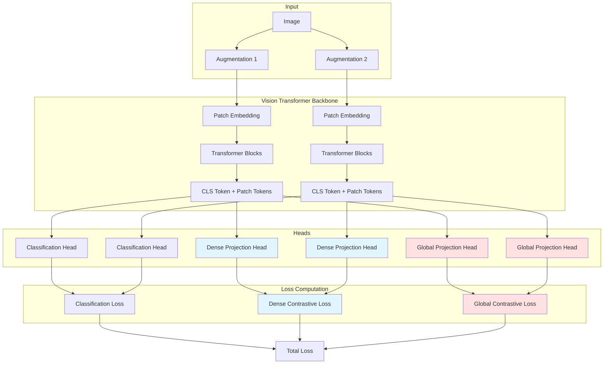
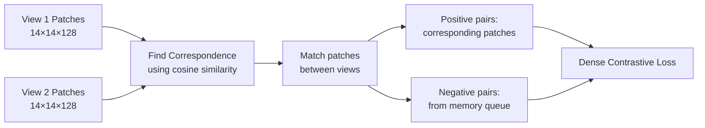
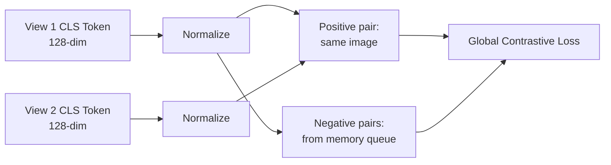
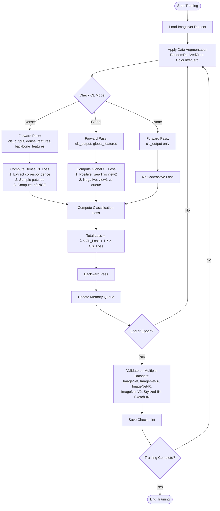
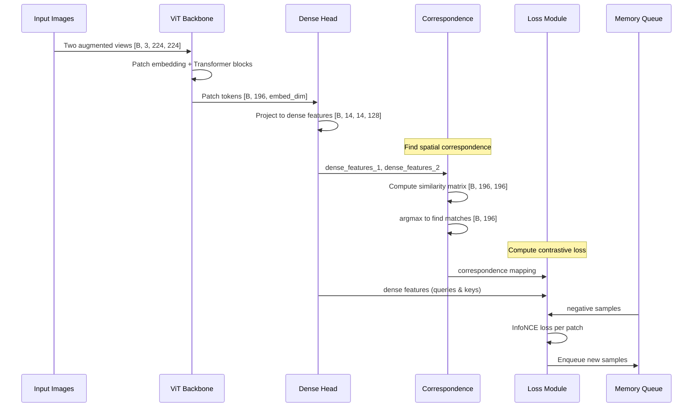
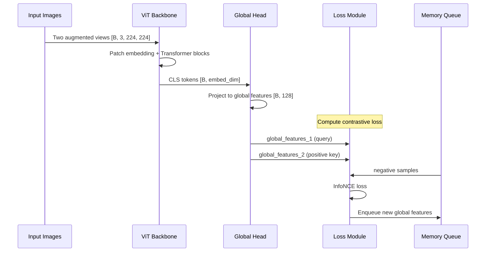

# Dense Contrastive Learning in Vision Transformers

## Table of Contents
1. [Project Motivation](#project-motivation)
2. [Architecture Overview](#architecture-overview)
3. [Three Training Modes](#three-training-modes)
4. [Project Flow](#project-flow)
5. [Implementation Details](#implementation-details)
6. [Limitations](#limitations)
7. [Usage Examples](#usage-examples)

---

## Project Motivation

### Why Dense Contrastive Learning?

Traditional contrastive learning methods (like MoCo, SimCLR) operate at the **image level**—they learn that two augmented views of the same image should have similar global representations. However, this approach has a critical limitation: **it doesn't capture fine-grained spatial correspondence**.

**Example Problem:**
- If you have an image of a dog in a park, standard contrastive learning learns "this is an image of a dog in a park"
- But it doesn't learn that the *dog's nose in view 1* corresponds to the *dog's nose in view 2*
- This spatial ignorance limits the model's ability to understand object parts, spatial relationships, and fine-grained features

### The Dense CL Solution

Dense Contrastive Learning addresses this by:
1. **Patch-level contrastive learning**: Each patch in the image gets its own contrastive objective
2. **Spatial correspondence**: Explicitly finds which patches in view 1 correspond to which patches in view 2
3. **Rich representations**: Forces the model to learn both global semantics AND local spatial structure

### Why Vision Transformers?

Vision Transformers (ViT) are perfect for this because:
- They naturally divide images into patches (typically 16×16 pixels)
- Each patch gets an embedding that captures local features
- Self-attention allows patches to exchange information
- We can easily extract both global (CLS token) and local (patch tokens) representations

### Expected Benefits

1. **Better feature quality**: Representations capture both global and local semantics
2. **Improved robustness**: Training on patch correspondences should make the model more robust to:
   - Occlusions (parts of objects hidden)
   - Viewpoint changes
   - Distribution shifts
3. **Transfer learning**: Rich spatial features should transfer better to downstream tasks like:
   - Object detection
   - Semantic segmentation
   - Dense prediction tasks

---

## Architecture Overview



### Key Components

1. **Vision Transformer Backbone**: Extracts features from images
   - Divides 224×224 image into 14×14 = 196 patches
   - Each patch becomes a 192/384/768-dim embedding (depending on model size)
   - CLS token aggregates global information

2. **Classification Head**: Standard linear layer for ImageNet classification
   - Input: CLS token [B, embed_dim]
   - Output: Class logits [B, 1000]

3. **Dense Projection Head** (Dense CL mode only):
   - Input: Patch tokens [B, 196, embed_dim]
   - Output: Dense features [B, 14, 14, 128]
   - Projects each patch to a lower-dimensional contrastive space

4. **Global Projection Head** (Global CL mode only):
   - Input: CLS token [B, embed_dim]
   - Output: Global features [B, 128]
   - Projects global representation to contrastive space

---

## Three Training Modes

This project supports **three mutually exclusive training modes**:

### 1. Dense Contrastive Learning Mode

**What it does:** Patch-level contrastive learning with spatial correspondence



**Key mechanisms:**
- **Correspondence extraction**: Finds which patch in view 1 matches which patch in view 2
- **Positive pairs**: Corresponding patches should have similar features
- **Negative pairs**: Patches from different images (stored in queue) should be dissimilar
- **Memory queue**: Maintains a large bank of negative samples (65,536 patches)

**Loss function:** InfoNCE loss applied to each patch
```
For each patch p in view 1:
  - Find corresponding patch p' in view 2
  - Maximize similarity(p, p')
  - Minimize similarity(p, queue_patches)
```

### 2. Global Contrastive Learning Mode

**What it does:** Image-level contrastive learning (like MoCo/SimCLR)



**Key mechanisms:**
- **Global representation**: Uses CLS token (designed to aggregate image-level info)
- **Positive pairs**: Two augmented views of the same image
- **Negative pairs**: CLS tokens from different images (stored in queue)
- **Memory queue**: Maintains 65,536 global representations

**Loss function:** InfoNCE loss on global features
```
For each image:
  - Maximize similarity(view1_CLS, view2_CLS)
  - Minimize similarity(view1_CLS, queue_CLS_tokens)
```

### 3. No Contrastive Learning Mode

**What it does:** Pure supervised classification (baseline)

- Only classification loss
- No contrastive objective
- Useful for comparing against CL methods

---

## Project Flow

### Training Pipeline



### Dense CL Forward Pass Details



### Global CL Forward Pass Details



---

## Implementation Details

### Data Augmentation Strategy

Two different augmentation pipelines create diverse views:

**View 1 (Standard):**
- RandomResizedCrop(224)
- RandomHorizontalFlip
- ColorJitter(brightness=0.4, contrast=0.4, saturation=0.4, hue=0.1)
- Normalize

**View 2 (Stronger):**
- RandomResizedCrop(224, scale=(0.2, 1.0)) ← more aggressive crop
- RandomHorizontalFlip
- ColorJitter (same as view 1)
- GaussianBlur (p=0.2) ← additional blur
- Normalize

### Memory Queue Mechanism

Both Dense and Global CL use a memory queue (FIFO) to maintain negative samples:

**Dense CL Queue:**
- Size: 65,536 patch features
- Sampling: Randomly/diversely/hardest sample 50 patches per image
- Update: Replace oldest patches with new ones
- Purpose: Provides diverse negative samples without storing all images

**Global CL Queue:**
- Size: 65,536 global features
- Update: Add batch of CLS token projections, remove oldest
- Purpose: Provides diverse negative image representations

**Why queues?**
- Computing negatives from all training data is infeasible (millions of images)
- Queues provide large negative sets (65k) without backprop through them
- Maintains diversity by constantly refreshing with new samples

### Correspondence Extraction (Dense CL)

Finding which patches correspond between two augmented views:

```python
# Compute similarity between all patch pairs
f1_norm = F.normalize(f1_flat, dim=2)  # [B, 196, D]
f2_norm = F.normalize(f2_flat, dim=2)  # [B, 196, D]
sim_matrix = torch.bmm(f1_norm, f2_norm.transpose(1, 2))  # [B, 196, 196]

# For each patch in view1, find most similar patch in view2
correspondence = torch.argmax(sim_matrix, dim=2)  # [B, 196]
```

**Intuition:** Despite augmentations, the same object part should have similar features across views.

### Loss Weighting

```python
total_loss = (1 - λ) × classification_loss + λ × contrastive_loss
```

- λ = 0: Pure supervised learning
- λ = 0.5: Equal weight to classification and contrastive learning
- λ = 1: Pure contrastive learning (usually not used)

**Adaptive weighting** option:
- Start with low λ (focus on classification)
- Gradually increase λ (introduce contrastive learning)
- Helps stability in early training

### Temperature Scaling

```python
similarity / temperature
```

- Lower temperature (0.07): Sharper distributions, more discriminative
- Higher temperature (0.5): Softer distributions, more forgiving
- Default: 0.2 (middle ground)
- Can be learned as a parameter

---

## Limitations

### 1. Computational Cost

**Dense CL is expensive:**
- Must compute correspondence for all patches (196×196 similarity matrix)
- Store and manage 65,536 patch features in queue
- Sample patches strategically
- **Memory**: ~2-3x more GPU memory than standard training
- **Time**: ~40-60% slower than classification-only training

**Global CL is cheaper:**
- Only one representation per image (not 196)
- Simpler queue operations
- **Memory**: ~1.5x classification-only
- **Time**: ~20-30% slower

### 2. Correspondence Quality

**Assumption**: Semantic correspondences exist between augmented views

**Problems:**
- Heavy crops may not overlap at all
- Extreme color jitter can break visual correspondence
- Rotation/scale changes make matching harder
- No guarantee that argmax similarity = true correspondence

**Impact**: Noisy correspondences could provide wrong supervision

### 3. Feature Collapse Risk

**What is it:** All features converge to the same representation

**Why it happens:**
- Model finds shortcut: make everything similar to avoid contrastive penalty
- Common in contrastive learning

**Mitigation strategies:**
- Large batch sizes (more diversity)
- Large queues (more negative samples)
- Temperature tuning
- Monitor effective rank metric

### 4. Hyperparameter Sensitivity

**Critical hyperparameters:**
- Queue size: Too small → collapse, too large → slow convergence
- Temperature: Too low → training instability, too high → weak gradients
- λ (loss weight): Too high → ignores classification, too low → ignores CL
- Batch size: Too small → noisy gradients, too large → memory issues

**Challenge**: Optimal values may differ across:
- Model sizes (tiny vs base)
- Datasets (ImageNet vs domain-specific)
- Training modes (dense vs global)

### 5. Dense CL Specific Issues

**Patch sampling strategy matters:**
- Random: Simple but may miss important regions
- Diverse: Better coverage but slower
- Hardest: Good for learning but can be unstable

**Queue diversity:**
- If queue contains patches from few images → less effective negatives
- Need to track and ensure diversity
- Trade-off: diversity vs computational cost

### 6. Transfer Learning Uncertainty

**Hypothesis**: Dense features → better transfer to spatial tasks

**Reality**: Unclear if benefits justify costs
- Dense features may be overspecialized to ImageNet
- Global features might transfer better to some tasks
- Need extensive evaluation on downstream tasks

### 7. Training Instability

**Potential issues:**
- Early training: Classification and CL may conflict
- Gradient magnitudes: CL gradients can dominate classification
- Queue initialization: Random features can cause early instability

**Solutions:**
- Warmup period for learning rate
- Gradient clipping
- Adaptive loss weighting
- Monitor metrics closely

### 8. Evaluation Complexity

**Multiple test sets required:**
- ImageNet (standard)
- ImageNet-A (adversarial)
- ImageNet-R (renditions)
- ImageNet-V2 (distribution shift)
- Stylized-ImageNet (texture bias)
- ImageNet-Sketch (domain shift)

**Challenge**: Improvements on one may not transfer to others

---

## Usage Examples

### Basic Training Commands

**Dense CL (default):**
```bash
python train.py \
    --cl-mode dense \
    --model-name vit_tiny_patch16_224 \
    --batch-size 256 \
    --epochs 100 \
    --lambda-weight 0.5 \
    --queue-size 65536 \
    --temperature 0.2 \
    --sampling-strategy diverse \
    --experiment-name dense_cl_tiny
```

**Global CL:**
```bash
python train.py \
    --cl-mode global \
    --model-name vit_tiny_patch16_224 \
    --batch-size 256 \
    --epochs 100 \
    --lambda-weight 0.5 \
    --queue-size 65536 \
    --temperature 0.2 \
    --experiment-name global_cl_tiny
```

**No CL (baseline):**
```bash
python train.py \
    --cl-mode none \
    --model-name vit_tiny_patch16_224 \
    --batch-size 256 \
    --epochs 100 \
    --experiment-name baseline_tiny
```

### Advanced Options

**Adaptive loss weighting:**
```bash
python train.py \
    --cl-mode dense \
    --contrastive-weight-adaptive \
    --lambda-weight 0.5  # final target weight
```

**Learnable temperature:**
```bash
python train.py \
    --cl-mode dense \
    --learnable-temp
```

**Different correspondence features:**
```bash
python train.py \
    --cl-mode dense \
    --correspondence-features backbone  # or 'dense'
```

### Key Configuration Parameters

| Parameter | Default | Description |
|-----------|---------|-------------|
| `--cl-mode` | `dense` | Training mode: `dense`, `global`, or `none` |
| `--model-name` | `vit_tiny_patch16_224` | ViT architecture |
| `--batch-size` | 256 | Training batch size |
| `--lambda-weight` | 0.5 | Weight for contrastive loss |
| `--queue-size` | 65536 | Size of negative sample queue |
| `--temperature` | 0.2 | Temperature for InfoNCE loss |
| `--sampling-strategy` | `random` | How to sample patches: `random`, `diverse`, `hardest` |
| `--dense-dim` | 128 | Projection dimension |
| `--learning-rate` | 0.00001 | Base learning rate |
| `--warmup-epochs` | 5 | Learning rate warmup period |
| `--grad-clip` | 5.0 | Gradient clipping value |

---

## Key Metrics to Monitor

### Training Metrics
- **Classification accuracy** (top-1, top-5)
- **Contrastive loss** (should decrease steadily)
- **Positive similarity** (should increase)
- **Negative similarity** (should decrease/stay low)
- **Feature effective rank** (should be high, not collapsed)
- **Queue diversity** (unique images in queue)
- **Temperature** (if learnable)

### Validation Metrics
- Standard ImageNet accuracy
- Robustness datasets (A, R, V2, Stylized, Sketch)
- Look for: improved robustness with CL

---

## Comparison: Dense vs Global CL

| Aspect | Dense CL | Global CL |
|--------|----------|-----------|
| **Granularity** | Patch-level (196 features) | Image-level (1 feature) |
| **Correspondence** | Explicit spatial matching | Implicit (same image) |
| **Computation** | High (196× more features) | Low (single feature) |
| **Memory** | High (large queues) | Moderate |
| **Training time** | Slower (~50% overhead) | Faster (~25% overhead) |
| **Feature richness** | Rich spatial structure | Global semantics only |
| **Expected strength** | Spatial tasks, occlusions | Image classification |
| **Complexity** | High (correspondence, sampling) | Low (standard CL) |

---

## Conclusion

This project explores whether **patch-level contrastive learning** can improve Vision Transformer representations beyond standard **image-level contrastive learning**. The hypothesis is that forcing the model to learn spatial correspondences between augmented views will create richer, more robust features.

The modular design allows clean comparison between:
1. Dense CL (patch-wise)
2. Global CL (image-wise)
3. No CL (supervised baseline)

All using the same ViT backbone and evaluation protocol.