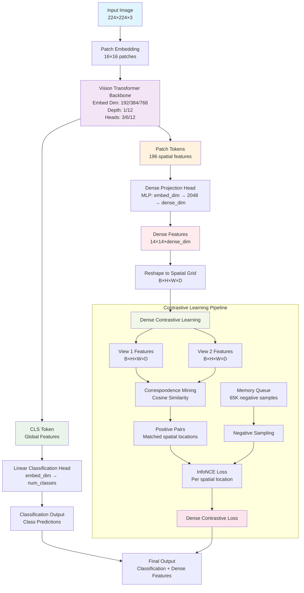

# DenseViT: Vision Transformer with Dense Contrastive Learning
## Introduction to Dense Contrastive Learning

Dense contrastive learning extends traditional contrastive learning from image-level to pixel-level representation learning. Unlike conventional approaches that learn global image representations, dense contrastive learning focuses on learning rich, spatially-aware features at every spatial location in the feature map.

## Proposed Architecture



Key Idea: While the CLS token handles global classification, patch tokens are processed through a dedicated dense projection head to generate spatially-aligned contrastive features. This dual-path design enables simultaneous learning of both global semantic understanding and fine-grained spatial representations.

## Dense Contrastive Loss

The DenseContrastiveLoss class implements pixel-level contrastive learning as described in the DenseCL paper. Unlike traditional contrastive learning that operates on global image representations, this approach learns contrastive features at every spatial location in the feature map, enabling fine-grained visual understanding.Mathematical Formulation

Given two augmented views of an image, the loss is computed similar to the InfoNCE loss:

L_dense = -log(exp(sim(q_i, k_i^+) / τ) / Σⱼ exp(sim(q_i, k_j) / τ))

Where:

    q_i: Query feature at spatial location i
    k_i^+: Positive key feature at corresponding location i
    k_j: Negative key features from memory queue
    τ: Temperature parameter (typically 0.1-0.2)
    sim(·,·): Cosine similarity function


### Key Components

#### Memory Queue Mechanism
The loss function maintains a persistent memory queue to store negative samples across training iterations:
Queue Properties:

1. Persistent Storage: Survives across forward passes, accumulating diverse negative samples.
2. Normalized Features: All features in queue are L2-normalized for consistent cosine similarity computation
3. Circular Buffer: Implements wrap-around logic to efficiently manage memory

####  Correspondence Extraction
The extract_correspondence method establishes pixel-level correspondences between two augmented views of the same image.
Mathematical Foundation:
For each spatial location i in view 1, the correspondence is computed as:

```correspondence[i] = argmax_j (cosine_similarity(f1[i], f2[j]))```

Where j iterates over all spatial locations in view 2.

Key Insights:

1. Robust Matching: Uses backbone features (before projection) for correspondence to ensure semantic consistency
2. Spatial Flexibility: Allows non-rigid correspondences, accommodating augmentation-induced spatial transformations
3. Efficiency: Vectorized computation using batch matrix multiplication

### Contrastive Loss Computation Step-by-Step Process:

Step 1: Correspondence Mining
Step 2: Feature Preparation
Step 3: Positive Pair Formation
Step 4: Negative Sampling
Step 5: InfoNCE Loss Application
Step 6: Queue Update

### Key Design Decisions

1. Backbone vs Projected Features: Uses backbone features for correspondence (semantic consistency) and projected features for contrastive loss (representation learning)
2. Queue Management Strategy: Implements circular buffer with wrap-around logic for efficient memory utilization